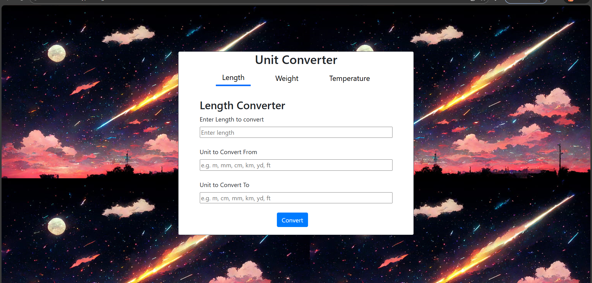
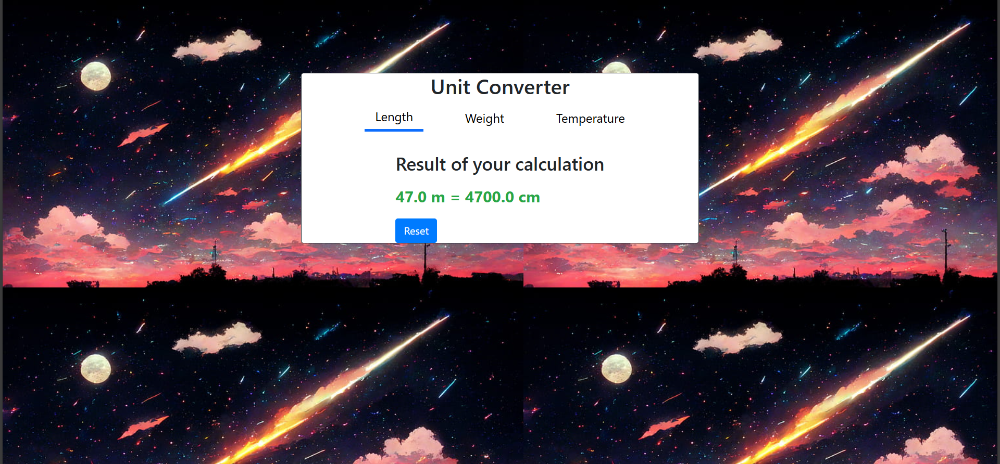

# 📏 Unit Converter Web App

A simple and interactive **Unit Converter** built using **Python (Flask)** and **HTML + Bootstrap**.
Supports conversion between **Length**, **Weight**, and **Temperature** units with a clean UI.

---

## 🚀 Features

### ✔ Convert Length Units

`m`, `cm`, `mm`, `km`, `in`, `ft`, `yd`

### ✔ Convert Weight Units

`kg`, `g`, `mg`, `lb(pounds)`, `oz(ounce)`

### ✔ Convert Temperature Units

`Celsius (C)`, `Fahrenheit (F)`, `Kelvin (K)`

### ✔ Additional Features

* Bootstrap responsive interface
* Tabs highlight the active converter
* Error messages for invalid inputs
* Reset functionality
* Clean & optimized backend logic

---

## 🛠️ Technologies Used

| Technology           | Purpose                              |
| -------------------- | ------------------------------------ |
| **Flask**            | Backend routing + template rendering |
| **Python**           | Conversion logic                     |
| **HTML + Bootstrap** | Frontend design                      |
| **Jinja2**           | Dynamic templates                    |

---

# 📂 Project Structure

```
Unit-Converter/
│── static/
│   ├── style.css
│   └── images/
│
│── templates/
│   └── index.html
│
│── app.py
│── README.md
```

---

# ▶️ How to Run the Project

```bash
git clone https://github.com/Abhinav1446/python-projects/unit-converter.git
cd unit-converter
pip install flask
python app.py
```

Open in the browser:

```
http://127.0.0.1:5000
```

---

# ⚙️ How `app.py` Works (Brief Explanation)

The `app.py` file contains **three main parts**:

---

## **1️⃣ Conversion Dictionaries and Functions**

The app defines dictionaries like:

```python
UNIT_TO_METER = { "m": 1, "cm": 0.01, ... }
```

These help convert any input value into a **base unit** (meters, kilograms, Celsius).

Each type has its own function:

* `convert_length()`
* `weight_convert()`
* `convert_temp()`

### How they work:

1. Convert the input value into a **base unit**

   * e.g., cm → meters
2. Convert from that base unit into the **target unit**

   * meters → ft
3. Return the final converted value.

---

## **2️⃣ Flask Routes**

The app has four main routes:

### **`/` (Home Page)**

Loads the main HTML page and displays the selected tab:

```python
measurement = request.args.get("type", "length")
```

Depending on the URL (`?type=length`, `weight`, or `temp`), it shows the correct form.

---

### **`/convert_length`**

Handles form submission for length conversions.

Steps:

1. Read form values
2. Validate inputs
3. Run `convert_length()`
4. Pass result back to HTML

HTML then displays either:

* the result, or
* an error message.

---

### **`/convert_weight`**

Same process → uses `weight_convert()`.

---

### **`/convert_temp`**

Converts temperature using `convert_temp()`.
Supports:

* C → F
* F → C
* C → K
* K → C
  etc.

---

## **3️⃣ Rendering Back to HTML**

After converting, each route calls:

```python
return render_template("index.html", ...)
```

Variables sent to the template include:

* `measurement` → which tab to show
* `result` → final converted value
* `error` → any error message
* `show_result` → True/False
* `value`, `unit_from`, `unit_to` → to display result like:

```
10 cm = 0.1 m
```

The HTML uses Jinja2:

```html

   <p>{{ value }} {{ unit_from }} = {{ result }} {{ unit_to }}</p>

```

So the page updates automatically based on backend values.

---

# 🧮 Example Conversion Output

```
Input: 100 cm  
Output: 1 m
```

```
Input: 5 kg  
Output: 11.023 lb
```

```
Input: 32 F  
Output: 0 C
```

---

# 📸 UI Preview

**Home Page




**Result Page


---

## 🤝 Credits

This project is inspired by the **Unit Converter** challenge on Roadmap.sh:  
➡️ https://roadmap.sh/projects/unit-converter


