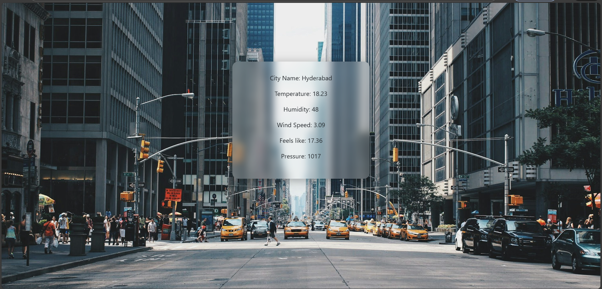

# ⭐  Weather App with Redis Caching


---

# 🌤️ Weather App with Redis Caching

A fast and efficient Weather Application built using **Flask**, **Redis**, and **OpenWeatherMap API**.
This project fetches weather data for any city and caches the results in Redis to avoid repeated API calls, making the app **faster** and **more cost-efficient**.

---

## 🚀 Features

*  Fetches **real-time weather** using OpenWeatherMap API
*  **Redis caching** to prevent repeated API calls
*  Automatically serves **cached results** if available
*  Graceful error handling for incorrect city or missing data
*  Clean UI built using **Bootstrap**
*  Organized folder structure with templates + static files
*  Redis runs inside Docker for easy setup

---

## 📁 Project Structure

```
project/
│ app.py
│ .env
│ README.md
│
├── templates/
│     ├── index.html
│     └── weather_info.html
│
└── static/
      ├── style.css
      └── images/
            backgro.jpg
```

---

## 🔧 Technologies Used

| Technology             | Purpose                                           |
| ---------------------- | ------------------------------------------------- |
| **Flask**              | Backend framework to handle routing and templates |
| **Redis**              | In-memory cache for storing weather responses     |
| **Docker**             | Run Redis server without installing it locally    |
| **OpenWeatherMap API** | Weather data provider                             |
| **Bootstrap**          | UI styling                                        |

---

## 🐳 Running Redis with Docker

Make sure Docker Desktop is installed.
Run Redis container:

```bash
docker run -d --name redis-server -p 6379:6379 redis
```

This starts a Redis server on port **6379**.

### Verify Redis is working

```bash
docker exec -it redis-server redis-cli
```

---

## 🔑 Environment Variables

Create a `.env` file in the project root:

```
API_KEY=your_openweather_api_key
REDIS_NAME=localhost
REDIS_PORT=6379
CACHE_TIME=300
BASE_URL=https://api.openweathermap.org/data/2.5/weather
```

Explanation:

| Variable     | Purpose                                      |
| ------------ | -------------------------------------------- |
| `API_KEY`    | Your OpenWeatherMap API key                  |
| `REDIS_NAME` | Redis hostname (localhost or container name) |
| `REDIS_PORT` | Redis port                                   |
| `CACHE_TIME` | Cache expiry time (in seconds)               |
| `BASE_URL`   | Base API URL for weather data                |

---

## ▶️ How to Run the App

### 1️⃣ Install dependencies

```bash
pip install flask redis requests python-dotenv
```

### 2️⃣ Start Redis using Docker

(If not already started)

```bash
docker start redis-server
```

### 3️⃣ Run Flask app

```bash
python app.py
```

### 4️⃣ Open in browser

```
http://127.0.0.1:5000
```

---

## 🧠 How Caching Works

1. User enters `City, Country`
2. Backend generates a Redis key:

```
weather:city,country
```

3. **If key exists → return cached response (FAST)**
4. **Else → call OpenWeather API**, extract required info, and store it in Redis:

```python
client.setex(cache_key, CACHE_TIME, json.dumps(data))
```

5. Next request for same city uses cached data.

This saves time and API usage.

---

## 🖼️ UI Preview

Form page:

```
+-------------------------------+
| Enter City, Country           |
| [Hyderabad,IN]                |
| [Submit]                      |
+-------------------------------+
```

Weather page:

```
Weather in Hyderabad
Temperature: 30°C
Humidity: 45%
Wind: 3 m/s
(From API or cache)
```

---
## Screenshots

 Home page

Enter the details: For e.g: {city_name},{country_name}


Weather information page :




---

## 📝 Credits

This project was inspired by:

🔗 [https://roadmap.sh/projects/weather-api-wrapper-service](https://roadmap.sh/projects/weather-api-wrapper-service)


---

## 👤 Author
**Gottiparthi Abhinav**

B.Tech CSE - Cyber Security
Enthusiastic about Backend Development, Cloud, and DevOps.

---

## ⭐ Want to Improve This Project?

some ideas:

* Add weather icons (sun, cloud, rain)
* Add temperature graphs
* Add user accounts + search history
* Add error messages on UI instead of plain text
* Deploy on AWS / Render / Railway


